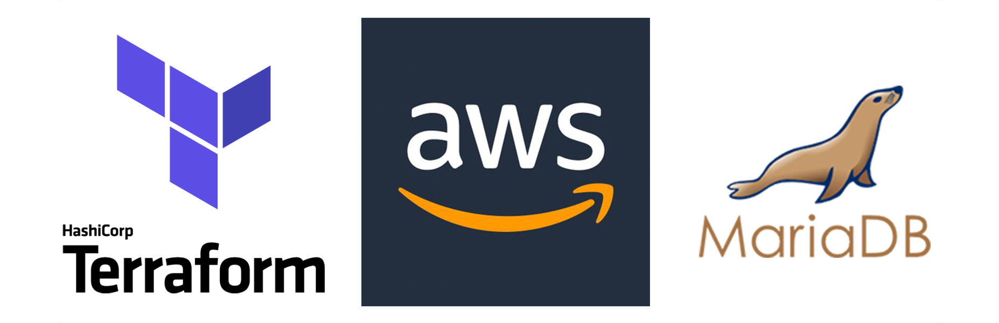

Overview:
---------

Terraform creates separate VPC in predefined AWS zone, with configured security groups, IP plan, route tables configuration, gateway, load balancer, target group, autoscaling group, preconfigured EC2 instances and MariaDB in RDS. This code is tested with Terraform v0.11.12.

Terraform script:
-----------------

A key pair has been created that will be assigned to our instances. A new EC2 launch configuration has also been created (this will be used with our auto scaling group). There have been defined variables for the minimum and maximum sizes of the auto scaling group. That variables have predefined default values to create a group that has minimum of 2 and maximum of 5 EC2 instances. The instances will be created in different AWS zones (within same region of course).

Inbound traffic for the web server instances is also predefined, before all is deployed into production some traffic is configured to reach web servers - so that the tests can be done with more ease. The first two rules will restrict inbound SSH and ICMP echo traffic by IP address to the same list of CIDR blocks that are allowed to access the application load balancer. This will use the value assigned to variable *allowed_cidr_blocks* in our file with variables. The third rule will restrict inbound HTTP traffic to only allow traffic from the load balancer.

List of variables that can be reconfigured in *04_variables.tf* file:

    AWS region
    AWS AMI
    name of the user that is ssh-ing into EC2
    The type of instance that will be used
    Name of MariaDB and access parameters
